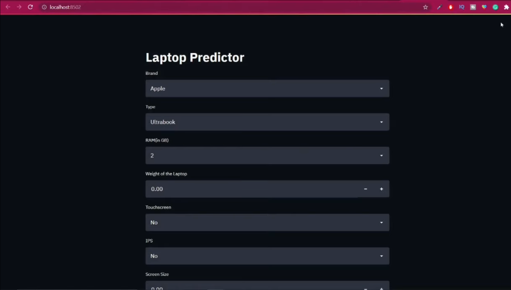

# 💻 Laptop Price Prediction using Machine Learning

This project predicts the price of a laptop based on its specifications using a regression machine learning model. It features a **Streamlit web app** where users can select laptop configurations and get instant price predictions.

---

## 🚀 Live Demo (Optional)

*You can host this on platforms like Streamlit Cloud or Heroku to enable a live demo link here.*

---

## 📦 Features

- Predict laptop prices using a trained Linear Regression model
- Interactive web interface using Streamlit
- Calculates PPI (Pixels Per Inch) based on screen size and resolution
- Input fields for brand, type, RAM, storage, GPU, OS, and more
- Lightweight and easy to deploy

---

## 🛠️ Tech Stack

- Python
- Streamlit
- Scikit-learn
- NumPy & Pandas
- Pickle (for model serialization)

---

## 🧠 How It Works

1. **Data Preprocessing:** Handled in the Jupyter Notebook (`laptop-price-predictor.ipynb`)  
2. **Model Training:** Uses Linear Regression after applying OneHotEncoding and feature transformation  
3. **Model Deployment:** Trained model is saved using `pickle` and used in `app.py` via Streamlit interface  
4. **Prediction Logic:** Includes custom logic to compute `PPI` and adjust features before prediction  

---

## 📂 Project Structure

